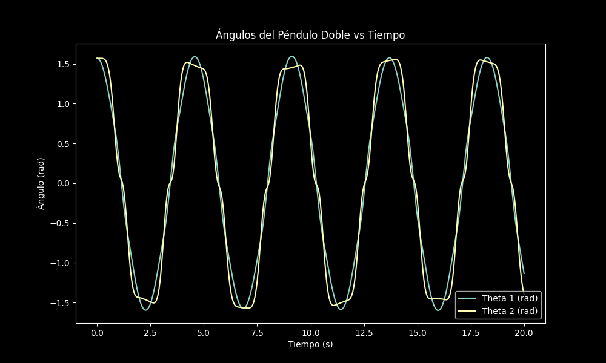
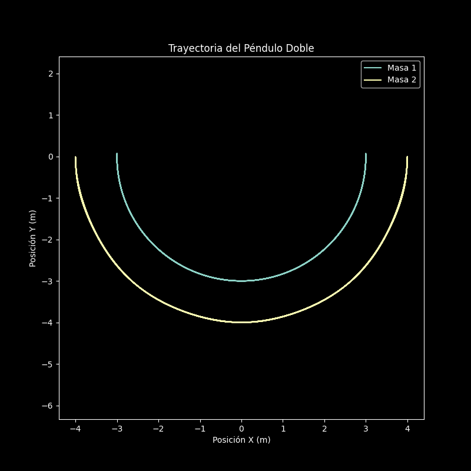
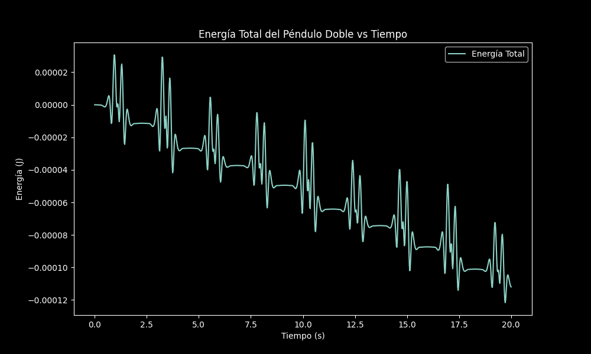
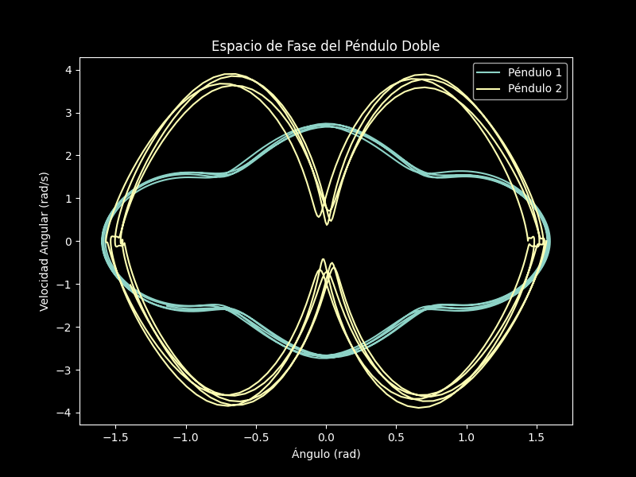

## El péndulo doble

Considerando las siguientes ecuaciones diferenciales

$$
\begin{align}
    (m_1 + m_2)l_1^2 \ddot{\theta}_1 + m_2 l_1 l_2 \ddot{\theta}_2 \cos(\theta_1 - \theta_2) + m_2 l_1 l_2 \dot{\theta}_2^2 \sin(\theta_1 - \theta_2) + (m_1 + m_2) g l_1 \sin(\theta_1) &= 0 \\
    m_2 l_2^2 \ddot{\theta}_2 + m_2 l_1 l_2 \ddot{\theta}_1 \cos(\theta_1 - \theta_2) - m_2 l_1 l_2 \dot{\theta}_1^2 \sin(\theta_1 - \theta_2) + m_2 g l_2 \sin(\theta_2) &= 0
\end{align}
$$

Luego consideraremos las siguientes substituciones:

$$
\begin{align*}
    \alpha &\equiv (m_1 + m_2)l_1^2, \\
    \beta &\equiv m_2l_1l_2\cos(\theta_1 - \theta_2), \\
    \gamma &\equiv m_2l_2^2, \\
    \delta &\equiv m_2l_1l_2\dot{\theta}_2^2\sin(\theta_1 - \theta_2) + l_1g(m_1 + m_2)\sin(\theta_1), \\
    \epsilon &\equiv -m_2l_1l_2\dot{\theta}_1^2\sin(\theta_1 - \theta_2) + l_2m_2g\sin(\theta_2).
\end{align*}
$$

llegamos a:

$$
\begin{align}
    \alpha \ddot{\theta}_1 + \beta \ddot{\theta}_2 + \delta &= 0 \\
    \gamma \ddot{\theta}_2 + \beta \ddot{\theta}_1 +\epsilon &= 0 
\end{align}
$$

Queremos despejar $\ddot{\theta}_1$ y $\ddot{\theta}_2$ en términos de las demás variables.

$$
\begin{align}
    \ddot{\theta}_1 &= \frac{\beta \epsilon - \gamma \delta}{\beta^2 - \alpha \gamma} \\
    \ddot{\theta}_2 &= \frac{\alpha \epsilon - \beta \delta}{\alpha \gamma - \beta^2}
\end{align}
$$

Ahora queremos transformar estas ecuaciones en una funcion vectorial para resolver estas edos con el metodo de Runge Kutta de orden 4. Definimos el vector de estado como:

$$
\mathbf{y} = \begin{bmatrix}
\theta_1 \\
\theta_2 \\
\dot{\omega}_1 \\
\dot{\omega}_2
\end{bmatrix}
$$

luego, la funcion vectorial queda como:

$$
\mathbf{f}(\mathbf{y}, t) = \begin{bmatrix}
\dot{\theta}_1 \\
\dot{\theta}_2 \\
\dot{\omega}_1 \\
\dot{\omega}_2
\end{bmatrix}
$$

luego, definimos un codigo en python que cree esta funcion vectorial.

```python
def f_vectorial(u, t, m1=m1, m2=m2, l1=l1, l2=l2):

    theta1, theta2, W1, W2 = u

    a = (m1 + m2) * l1**2
    b = m2 * l1 * l2 * np.cos(theta1 - theta2)
    c = m2 * l2**2
    d = m2 * l1 * l2 * (W2**2) * np.sin(theta1 - theta2) + l1 * g * (m1 + m2) * np.sin(theta1)
    e = -m2 * l1 * l2 * (W1**2) * np.sin(theta1 - theta2) + l2 * m2 * g * np.sin(theta2)
    return np.array([W1, W2, (-b / a) * (((d * b) / a - e) / (c - (b**2) / a)) - d / a, ((b * d) / a - e) / (c - (b**2) / a)])
```

Tambien definimos las condiciones iniciales y el arreglo de tiempo para la simulacion:

```python
dt = 0.01
x0 = np.array([np.pi/2, np.pi/2, 0, 0]) #Condiciones iniciales [Theta1, Theta2, Omega1, Omega2]
t = np.linspace(0, 20, 1000) #Tiempo
m1, m2, l1, l2, g = 1, 2, 3, 1, 9.81
```


Luego, usamos el metodo de Runge Kutta de orden 4 para resolver las ecuaciones diferenciales por lo que tendremos un grafico tal que:



Ahora nosotros queremos graficar el espacio de fase, la energia total del sistema y las trayectorias de los péndulos.

Para graficar el espacio de fase, podemos usar las siguientes ecuaciones para la energía cinética y potencial del sistema:

```python
    #Posiciones y velocidades en coordenadas cartesianas
    x1 = l1*np.sin(X[:,0])
    x2 = x1 + l2*np.sin(X[:,1])

    y1 = l1*np.cos(X[:,0])
    y2 = y1 + l2*np.cos(X[:,1])

    v1_x = l1*X[:,2]*np.cos(X[:,0])
    v2_x = v1_x + l2*X[:,3]*np.cos(X[:,1])

    v1_y = -l1*X[:,2]*np.sin(X[:,0])
    v2_y = v1_y -l2*X[:,3]*np.sin(X[:,1])

    #Energias Cineticas:
    K1 = 0.5*m1*l1**2*X[:,2]**2
    K2 = 0.5*m2*(v2_x**2 + v2_y**2)

    #Energia Potencial: 
    U = m1*g*y1 + m2*g*y2 

    #Energia Total:
    E = K1 + K2 + U
```

Luego graficamos y tenemos:





